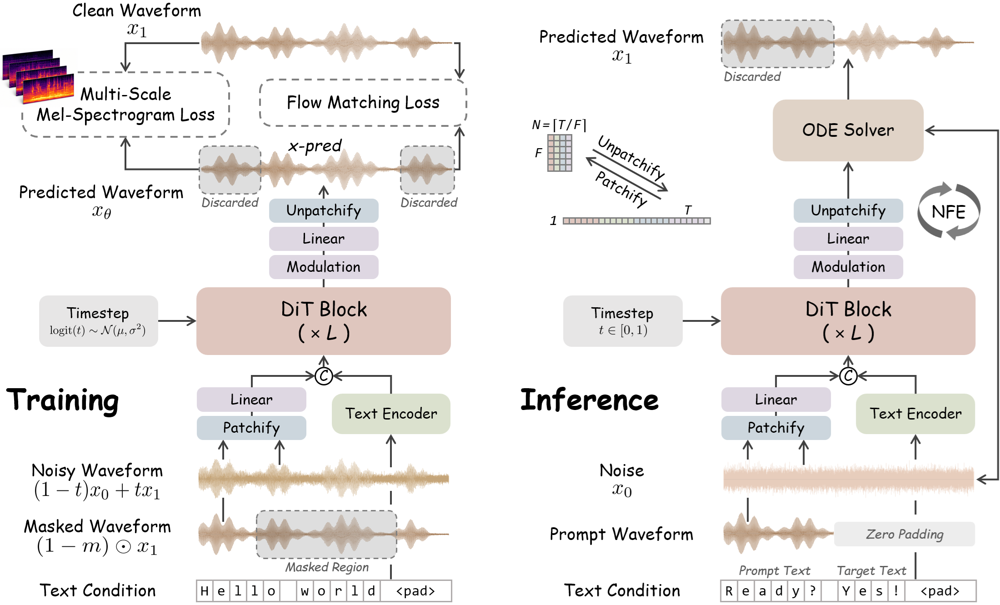

<div align="center">
  <h1>
  WavTTS: Towards High-Quality Zero-Shot TTS via Direct Raw Waveform Modeling
  </h1> 

  <p align="center">
    <a href="#installation"></a>
    <a href="https://arxiv.org/abs/2606.03455"></a>
    <a href="https://wavtts.github.io/"></a>
    <a href="https://huggingface.co/worstchan/WavTTS"></a>
  </p>

  <p align="center">
    <i>End-to-end zero-shot TTS directly in the raw waveform space.</i>
  </p>

</div>

## 📖 Introduction

WavTTS is an end-to-end zero-shot TTS framework that generates speech directly in the raw waveform space, without relying on intermediate acoustic representations such as mel-spectrograms, VAE latents, or codec tokens. Built on flow matching with DiT, WavTTS combines waveform patchification, multi-scale mel-spectrogram supervision, and optimized noise scheduling to achieve high-quality waveform generation. For more details, please refer to our paper: [WavTTS: Towards High-Quality Zero-Shot TTS via Direct Raw Waveform Modeling](https://arxiv.org/abs/2606.03455).

<div align="center">
  
</div>

**Note:** This repository is based on [F5-TTS](https://github.com/SWivid/F5-TTS). For general usage, troubleshooting, and basic guidance, please refer to the original F5-TTS repository. The sections below outline workflows specific to WavTTS.

## 🚀 News

- **[2026-06-03]**: We have released the WavTTS codebase along with the official 16 kHz checkpoint. Please note that this project is still under active development, and we will continue to roll out updates and improvements.


## ⚙️ Installation

We recommend using Conda to manage the environment and dependencies.

```bash
# 1. Clone the repository
git clone https://github.com/cwx-worst-one/WavTTS
cd WavTTS

# 2. Create and activate a virtual environment
conda create -n wavtts python=3.10
conda activate wavtts

# 3. Install PyTorch (>=2.2.0) with CUDA support, e.g.,
pip install torch==2.6.0 torchaudio==2.6.0 --index-url https://download.pytorch.org/whl/cu124

# 4. Install WavTTS in editable mode
pip install -e .
```

## 📦 Model Checkpoints

The official WavTTS checkpoint is available on Hugging Face: [WavTTS 🤗](https://huggingface.co/worstchan/WavTTS). The default checkpoint supports 16 kHz zero-shot TTS inference and will be downloaded automatically the first time you run the inference script.

## 🚀 Inference

WavTTS supports both command-line inference and script-based inference. For more details, please refer to the [Inference Guide](src/wavtts/infer/README.md).

### CLI Inference

Generate speech using a short reference audio prompt. CLI arguments will automatically override values defined in the TOML config.

```bash
wavtts_infer-cli \
  --model WavTTS \
  --ref_audio "provide_prompt_wav_path_here.wav" \
  --ref_text "The content, subtitle, or transcription of the reference audio." \
  --gen_text "The text you want WavTTS to synthesize."
```

Alternatively, manage your parameters cleanly using a TOML configuration file:

```bash
# Use the provided default config
wavtts_infer-cli -c src/wavtts/infer/examples/basic.toml

# Use a custom config (with an inline text override)
wavtts_infer-cli -c custom.toml --gen_text "Override text here."
```

### Script-based Inference

For customized pipelines, you can directly modify the paths and texts in `src/wavtts/infer/infer.sh` and execute:

```bash
bash src/wavtts/infer/infer.sh
```


## 🏋️ Training

Training WavTTS requires preprocessed dataset metadata. For a complete walkthrough of data preparation, training, and fine-tuning, please refer to the [Training Guide](src/wavtts/train/README.md).

### Data Preparation

We use [Emilia](https://huggingface.co/datasets/amphion/Emilia-Dataset) as the training dataset in our main experiments. After downloading Emilia, update the paths in the preparation script and run:

```bash
# Prepare training metadata for the Emilia dataset
python src/wavtts/train/datasets/prepare_emilia.py
```

Preparation scripts for other datasets like LibriTTS are available under `src/wavtts/train/datasets/`. To use a custom dataset, please adapt the loading logic in `src/wavtts/model/dataset.py`.

### Launching Training

WavTTS can be trained directly with `accelerate`:

```bash
# Step 1: Configure Accelerate (e.g., multi-GPU DDP, mixed precision)
accelerate config

# Step 2: Launch training using a Hydra config
# YAML configuration files are located under the src/wavtts/configs/ directory.
accelerate launch src/wavtts/train/train.py --config-name WavTTS.yaml

# Example with inline overrides:
accelerate launch --mixed_precision=bf16 src/wavtts/train/train.py --config-name WavTTS.yaml ++datasets.batch_size_per_gpu=19200
```

For our main experiments, we provide a unified launcher script. Remember to edit the default environment variables at the top of the script before running:

```bash
bash src/wavtts/train/run_main_train.sh
```


## 📊 Evaluation

For evaluation setup, dataset preparation, and objective metric scripts, please refer to the [Evaluation Guide](src/wavtts/eval/README.md).


## 🙏 Acknowledgements

WavTTS is built upon the awesome [F5-TTS](https://github.com/SWivid/F5-TTS) codebase, with references to the implementations of [DAC](https://github.com/descriptinc/descript-audio-codec) and [JiT](https://github.com/LTH14/JiT). We sincerely thank the authors for their invaluable open-source contributions.

If you encounter general pipeline or environment issues, we recommend first checking the [F5-TTS issue tracker](https://github.com/SWivid/F5-TTS/issues), where many common questions may have already been discussed or resolved.

## 📝 Citation

If you find this work useful in your research, please consider citing our paper:

```bibtex
@article{chen2026wavtts,
  title={WavTTS: Towards High-Quality Zero-Shot TTS via Direct Raw Waveform Modeling},
  author={TODO},
  journal={TODO},
  year={TODO}
}
```

## 📜 License

The codebase of this repository is released under the MIT License. Due to the license restrictions of the Emilia training dataset, the released pre-trained model weights are licensed under CC BY-NC 4.0.
